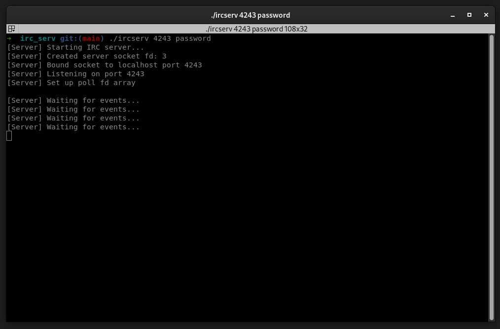

# ft_irc

## Introduction

Internet Relay Chat is a text-based communication protocol on the Internet.
It is mainly used for instant messaging in the form of group discussions through chat channels,
but it can also be used for direct communication between two people.
IRC clients connect to IRC servers in order to access these channels.
IRC servers are interconnected to form networks.

The goal of this project is to reproduce the behavior of an IRC server.

Here are some additional features I’ve added to make the server even closer to a real IRC server:

• File transfer.
• A bot.

<p align="center">
  
</p>

## Clone the repository
```bash
git clone git@github.com:louakedwayl/irc_serv.git
```

## installation

```bash
make
````

## start the server
```
./ircserv PORT PASSWORD
```
